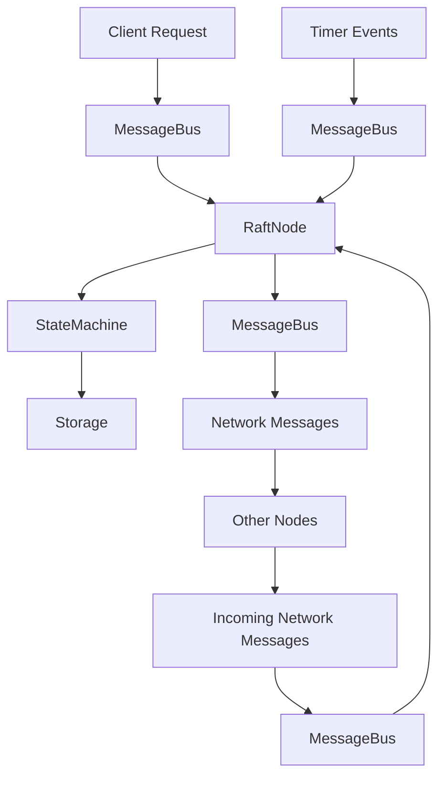

# System Patterns

## Architecture Overview

The kvapp-c system follows an **Event-Driven Architecture** with **Dependency Injection** patterns to create a loosely coupled, testable distributed key-value store implementing the Raft consensus algorithm.

## Core Design Patterns

### 1. Event-Driven Architecture
- **MessageBus**: Central event routing system (synchronous, no async)
- **Event Types**: RaftEvent, ClientEvent, NetworkEvent, TimerEvent
- **Loose Coupling**: Components communicate through events, not direct calls
- **Testability**: Easy to mock event flows and isolate components

### 2. Dependency Injection
- **Trait-Based Interfaces**: All major components implement traits
- **Constructor Injection**: Dependencies passed during component creation
- **Mock-Friendly**: Enables comprehensive unit testing with mock implementations

### 3. State Machine Pattern
- **RaftState**: Manages node states (Leader, Follower, Candidate)
- **Clear Transitions**: Well-defined state transition rules
- **Event-Driven Transitions**: State changes triggered by events

## Component Relationships



## Key Interfaces

### Storage Layer Traits
```rust
trait LogStorage {
    fn append_entries(&mut self, entries: Vec<LogEntry>) -> Result<(), Error>;
    fn get_entry(&self, index: u64) -> Option<LogEntry>;
    fn get_last_index(&self) -> u64;
    fn get_last_term(&self) -> u64;
}

trait StateStorage {
    fn save_current_term(&mut self, term: u64) -> Result<(), Error>;
    fn get_current_term(&self) -> u64;
    fn save_voted_for(&mut self, candidate: Option<NodeId>) -> Result<(), Error>;
    fn get_voted_for(&self) -> Option<NodeId>;
}
```

### Communication Layer Traits
```rust
trait NetworkTransport {
    fn send_message(&self, to: NodeId, message: RaftMessage) -> Result<(), Error>;
    fn receive_messages(&self) -> Vec<(NodeId, RaftMessage)>;
}

trait EventBus {
    fn publish(&self, event: Event);
    fn subscribe(&self, handler: Box<dyn EventHandler>);
}
```

### Application Layer Traits
```rust
trait StateMachine {
    fn apply(&mut self, entry: LogEntry) -> Result<Vec<u8>, Error>;
    fn snapshot(&self) -> Vec<u8>;
    fn restore_snapshot(&mut self, snapshot: Vec<u8>) -> Result<(), Error>;
}
```

## Critical Implementation Paths

### 1. Leader Election Flow
1. **Timeout Event** → MessageBus → RaftNode
2. **State Transition** → Follower to Candidate
3. **RequestVote Messages** → NetworkTransport → Other Nodes
4. **Vote Collection** → Majority check
5. **Leader Transition** → Start heartbeats

### 2. Log Replication Flow
1. **Client Request** → MessageBus → RaftNode (Leader)
2. **Log Entry Creation** → LogStorage.append_entries()
3. **AppendEntries Messages** → NetworkTransport → Followers
4. **Acknowledgment Collection** → Majority check
5. **Commit Decision** → StateMachine.apply()

### 3. Failure Recovery Flow
1. **Network Partition Detection** → Timeout events
2. **Leader Election** → New leader emerges
3. **Log Consistency Check** → Resolve conflicts
4. **State Synchronization** → Catch up followers

## Synchronous Design Decisions

### No Async Runtime
- **Threads + Channels**: Use std::thread and std::sync::mpsc
- **Blocking Operations**: Simpler reasoning about state
- **Easier Debugging**: Standard debugging tools work well
- **Deterministic Testing**: Easier to write deterministic tests

### Event Processing
- **Sequential Processing**: Events processed one at a time per component
- **Thread-Safe Communication**: Channels for inter-thread communication
- **Timeout Handling**: Timer threads send timeout events

## Testing Patterns

### Unit Testing
- **Mock Implementations**: For all trait-based dependencies
- **State Verification**: Assert correct state transitions
- **Event Verification**: Verify correct events are published
- **Isolation**: Test components in complete isolation

### Integration Testing
- **Multi-Node Simulation**: Create clusters with mock network
- **Failure Scenarios**: Simulate network partitions, node failures
- **Consistency Verification**: Verify all nodes reach same state
- **Performance Testing**: Measure consensus latency and throughput

## Error Handling Patterns

### Result-Based Error Handling
- **No Panics**: All operations return Result<T, Error>
- **Error Propagation**: Use ? operator for clean error handling
- **Specific Error Types**: Different error types for different failure modes
- **Recovery Strategies**: Well-defined recovery procedures

### Fault Tolerance
- **Graceful Degradation**: System continues with reduced functionality
- **Automatic Recovery**: Self-healing when conditions improve
- **Observable Failures**: Clear logging and metrics for debugging
