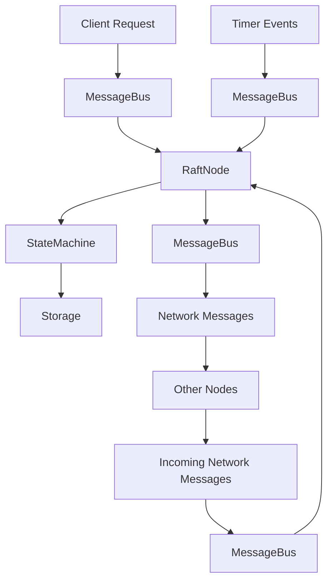

# Objectives
* Create a Key Value application built on the Raft Consensus Algorithm. 
* Design this application to be fully testable and debuggable.

# Raft Consensus Algorithm
* Original paper at https://raft.github.io/raft.pdf
* Additional information can be found at https://raft.github.io

# Implementation 

## Language
* Rust Edition 2024

## Development Environment
- **Windows 10** - Primary development platform
- **VSCode** - IDE with Rust analyzer extension
- **Git** - Version control

## Design Decisions
* No async runtime
* Minimal dependencies
* Use Standard library when possible
* Well defined Interfaces
* Testability 

## Design Patterns
* Dependency Injection pattern should be used when possible to de-couple components

## Architecture
* Event-Driven Architecture


# Proposed Design Architecture

## Core Components

### Raft Node Components
- **RaftNode** - Main coordinator implementing Raft state machine
- **RaftState** - Manages current state (Leader, Follower, Candidate)
- **Log** - Persistent log storage for consensus entries
- **StateMachine** - Key-value store that applies committed entries

### Communication Layer
- **MessageBus** - Event-driven message routing (no async)
- **NetworkTransport** - Handles inter-node communication
- **MessageTypes** - Raft protocol messages (AppendEntries, RequestVote, etc.)

### Storage Layer
- **LogStorage** - Persistent log entries
- **StateStorage** - Node metadata (current term, voted for)
- **KVStorage** - Key-value data store

## Event-Driven Design

### Event Types
- **RaftEvent** - Internal state transitions
- **ClientEvent** - Key-value operations (Get, Put, Delete)
- **NetworkEvent** - Inter-node messages
- **TimerEvent** - Election and heartbeat timeouts

### Event Flow


## Module Structure

```
src/
├── main.rs                 # Application entry point
├── lib.rs                  # Library root
├── raft/
│   ├── mod.rs             # Raft module
│   ├── node.rs            # RaftNode implementation
│   ├── state.rs           # State management
│   ├── log.rs             # Log operations
│   └── messages.rs        # Message types
├── storage/
│   ├── mod.rs             # Storage module
│   ├── log_storage.rs     # Log persistence
│   ├── state_storage.rs   # State persistence
│   └── kv_storage.rs      # Key-value storage
├── network/
│   ├── mod.rs             # Network module
│   ├── transport.rs       # Network transport
│   └── message_bus.rs     # Event routing
├── kv/
│   ├── mod.rs             # KV module
│   ├── store.rs           # Key-value operations
│   └── client.rs          # Client interface
└── tests/
    ├── integration/       # Integration tests
    └── unit/             # Unit tests
```

## Key Interfaces (Dependency Injection Ready)

```rust
// Core traits for dependency injection
trait LogStorage {
    fn append_entries(&mut self, entries: Vec<LogEntry>) -> Result<(), Error>;
    fn get_entry(&self, index: u64) -> Option<LogEntry>;
    fn get_last_index(&self) -> u64;
    fn get_last_term(&self) -> u64;
}

trait NetworkTransport {
    fn send_message(&self, to: NodeId, message: RaftMessage) -> Result<(), Error>;
    fn receive_messages(&self) -> Vec<(NodeId, RaftMessage)>;
}

trait StateMachine {
    fn apply(&mut self, entry: LogEntry) -> Result<Vec<u8>, Error>;
    fn snapshot(&self) -> Vec<u8>;
    fn restore_snapshot(&mut self, snapshot: Vec<u8>) -> Result<(), Error>;
}

trait EventBus {
    fn publish(&self, event: Event);
    fn subscribe(&self, handler: Box<dyn EventHandler>);
}
```

## Testing Strategy

### Unit Tests
- Mock implementations for all traits
- State transition testing
- Log consistency verification
- Message handling validation

### Integration Tests
- Multi-node cluster simulation
- Network partition scenarios
- Leader election testing
- Data consistency verification

### Property-Based Testing
- Raft safety properties
- Liveness properties under various conditions

## Implementation Phases

### Phase 1: Core Infrastructure
- Basic Raft state machine
- Message types and event system
- Storage abstractions
- Unit test framework

### Phase 2: Consensus Implementation
- Leader election
- Log replication
- Safety mechanisms
- Basic integration tests

### Phase 3: Key-Value Layer
- KV store implementation
- Client interface
- Command processing
- End-to-end testing

### Phase 4: Advanced Features
- Cluster membership changes
- Snapshot support
- Performance optimization
- Comprehensive testing

## Design Decisions Rationale

1. **No Async**: Using threads and channels for concurrency, making debugging easier
2. **Event-Driven**: Loose coupling between components, easier testing
3. **Trait-Based**: Dependency injection enables comprehensive mocking
4. **Modular**: Clear separation of concerns for maintainability
5. **Synchronous**: Simpler reasoning about state and easier debugging
